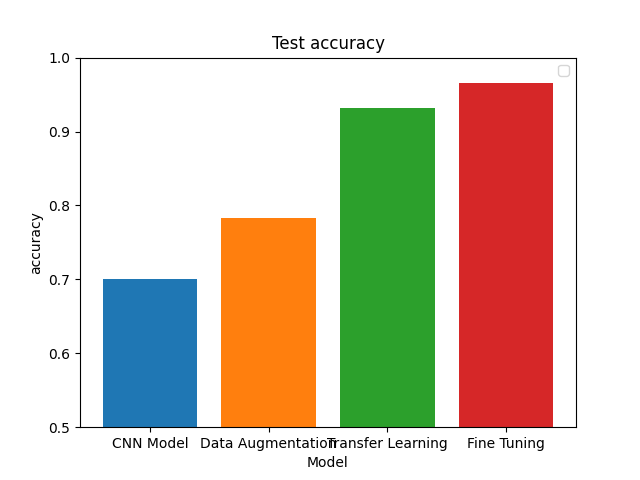
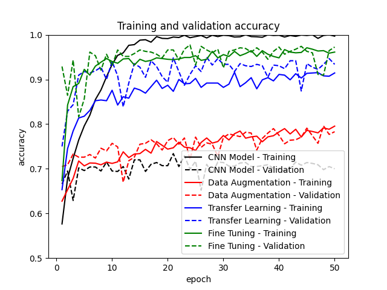
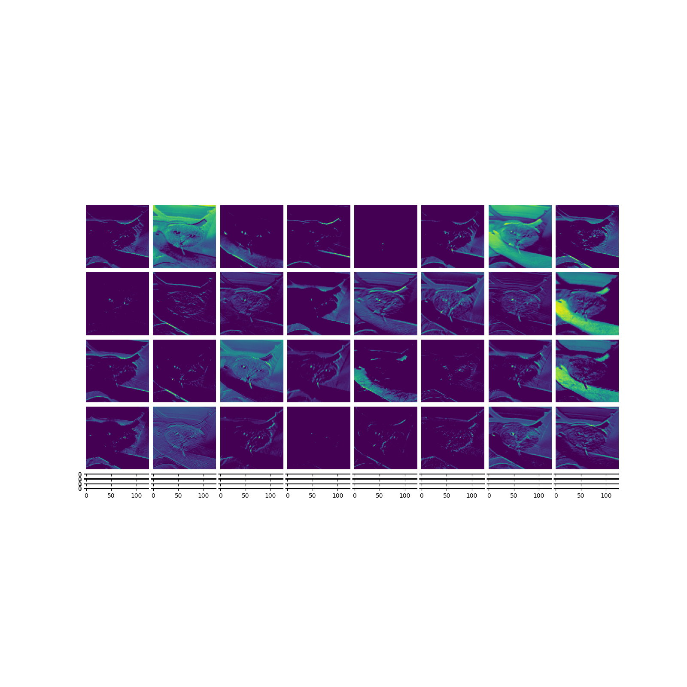
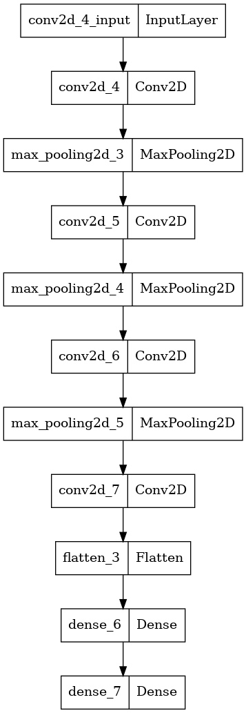

# dog-cat
Práctica para la asignatura de Inteligencia Artifical en la que entrenamos varios modelos para clasificar imágenes de perros y de gatos.

### Comparación de modelos

### Visualización de capas convolucionales

### Diagrama del modelo básico

## Referencias
- [Libro Jordi torres](https://torres.ai/python-deep-learning/)